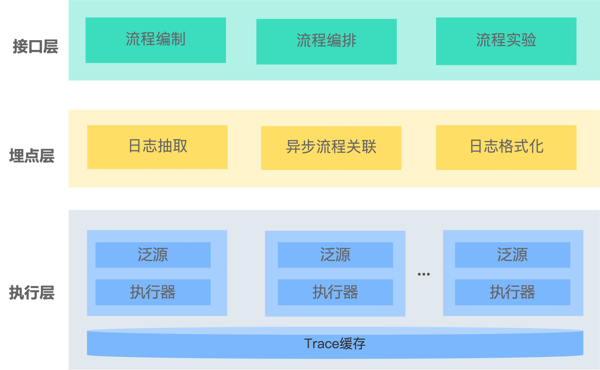

# 项目简介
星盘(Horoscope)是一款面向模型的实时流程编排框架, 主要定位是辅助构建云原生场景下的实时机器学习系统. 星盘来源于滴滴在地图路网数据更新业务上的多年实践经验. 实践中我们发现, 复杂的业务场景很难抽象为端到端(end-to-end)的机器学习应用, 常需要将很多机器学习微服务组装在一起, 而搭建这样的系统会面临下列挑战:
+ 持续的工程开发成本高: 机器学习相关的业务问题有很强的不确定性, 策略流程代码和微服务系统管理代码相互耦合, 流程代码会随着业务不断迭代变化, 扩展和管理困难
+ 复杂的业务流程很难解释: 机器学习系统会面临来自环境变化的影响, 数据输入分布不断变化, 会产生Bad Case, 需要在流程编排时考虑如何埋点, 便于高效分析和解释
+ 模型替换和实验周期长: 在流程的某个环节上会需要进行算法版本的迭代, 需要考虑如何小流量实验, 如何控制实验风险, 如何进行实验分析等问题

星盘旨在为以上三方面的挑战提供通用的解决框架, 目前星盘已经落地在滴滴地图路网动态数据更新, 安全异常绕路检测, 公交数据站点挖掘等业务场景, 大幅提升了机器学习系统的研发效率.

# 核心功能
+ **流程编排**: 星盘设计了一种流程图语言FlowDSL, 用于编排策略流程, 管理和不同微服务的交互过程. FlowDSL的设计思想借鉴了金融和OA领域常见的商业过程管理模型(Business process management，BPM), BPM很适合用来管理多角色参与的复杂流程. FlowDSL具有图灵完全的表达能力, 同时有良好的可扩展性, 支持用户自定义算子
+ **流程埋点**: 框架提供自动埋点, 异步流程关联和自定义埋点功能. 用户只需要在FlowDSL中描述埋点逻辑, 框架会处理日志格式转化, 关联和输入输出等底层细节, 提升埋点开发效率
+ **模型实验**: 支持A/B小流量实验, 可用于模型替换. 同时, 基于FlowDSL可以方便扩展一些高级的实验功能, 例如超参调优, 主动学习采样
+ **实时分布式**: Flow的执行层是高并发, 高可用的实时流架构, 集群可动态伸缩, 同时支持状态缓存

# 快速开始
[5分钟快速搭建服务](./docs/programming-guides/quick-start.md)

[股票舆情分析](./docs/examples/demo.md)

# 系统架构

星盘框架分为三层:
+ 接口层: 定义了流程编制, 编排和实验的接口. 在星盘系统中, 流程编制指一个可执行的流程单元, 用于串连和各个微服务的交互过程. 流程编排指管理多个流程之间的交互关系, 例如过程调用, 延迟调度
+ 埋点层: 基于编排定义, 框架会自动地抽取, 关联和转换埋点日志
+ 执行层: Flow执行是分布式的, 每台机器的泛源指实时流, 例如kakfa的一个topic. 执行器负责编译和执行Flow, trace缓存用于支持带状态的计算.

# 业界系统对比
开源社区与星盘有相似功能的系统对比如下:
+ [Flink](https://flink.apache.org/): 星盘系统早期曾采用Flink实现大数据实时挖掘流程, Flink更适合实时报表的生产流程, 我们的业务中有需要和边缘设备交互的场景, 这样的流程是一个环状的异步实时流, 用Flink实现比较困难
+ [Netflix Conductor](https://netflix.github.io/conductor/): 由Netflix公司开发的面向微服务的流程编排引擎, 该引擎可管理复杂的微服务流程, 但流程表达的丰富程度不够, 不支持埋点和实验, 同时不支持高吞吐的实时流
+ [Airflow](https://airflow.apache.org/): 主要提供离线数据报表的ETL流程编排功能, 有很好的可扩展性, 但不支持实时数据流场景

# 用户文档
+ 开发指南
    + flow dsl.md
    + flow expression.md
    + flow builtin udf.md
    + compositor.md
+ 案例
    + 与机器学习场景相关的demo1
+ 详细设计
    + flow编译执行的原理
+ Release Notes

# 社区活动
微信用户群

# 团队简介
创始人: wenxiang
内部核心开发者: ChaiYi, Cyanny Liang(https://github.com/lgrcyanny), liuguangyao
贡献者磅单: 

# 开源计划
- 星盘1.0: 开源local版本, 包括编排, 埋点功能
- 星盘1.1: 开源分布式版本, 预计2022年6月
- 星盘1.2: 开源分布式控制台, 预计2022年7月

