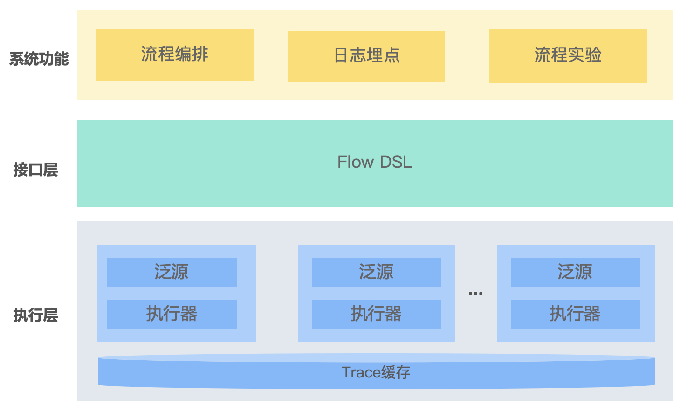

# 目录
+ [项目简介](# 项目简介)
+ [核心功能](# 核心功能)
+ [快速开始](# 快速开始)
+ [系统架构](# 系统架构)
+ [业界系统对比](## 业界系统对比)
+ [用户文档](# 用户文档)
  + [开发指南](## 开发指南)
    + [FlowDSL](### FlowDSL)
    + [流程编制](### 流程编制)
    + [流程编排](### 流程编排)
    + [流程埋点](### 流程埋点)
    + [实验分析](### 实验分析)
  + [星盘拓展](## 星盘拓展)
+ [相关文档](# 相关文档)
+ [团队简介](# 团队简介)
+ [开源计划](# 开源计划)


# 项目简介
星盘(Horoscope)是一款面向模型的实时流程编排框架, 主要定位是辅助构建云原生场景下的实时机器学习系统。星盘来源于滴滴在地图路网数据更新业务上的多年实践经验。实践中我们发现, 复杂的业务场景很难抽象为端到端
(end-to-end)的机器学习应用, 常需要将很多机器学习微服务组装在一起, 而搭建这样的系统会面临下列挑战:
+ 持续的工程开发成本高: 机器学习相关的业务问题有很强的不确定性, 策略流程代码和微服务系统管理代码相互耦合, 流程代码会随着业务不断迭代变化, 扩展和管理困难。
+ 复杂的业务流程很难解释: 机器学习系统会面临来自环境变化的影响, 数据输入分布不断变化, 会产生Bad Case, 需要在流程编排时考虑如何埋点, 便于高效分析和解释。
+ 模型替换和实验周期长: 在流程的某个环节上会需要进行算法版本的迭代, 需要考虑如何小流量实验, 如何控制实验风险, 如何进行实验分析等问题。

星盘旨在为以上三方面的挑战提供通用的解决框架, 目前星盘已经落地在滴滴地图路网动态数据更新, 安全异常绕路检测, 公交数据站点挖掘等业务场景, 大幅提升了机器学习系统的研发效率。

# 核心功能
+ **流程编排**: 星盘设计了一种流程图语言FlowDSL, 用于编排策略流程, 管理和不同微服务的交互过程. FlowDSL的设计思想借鉴了金融和OA领域常见的商业过程管理模型(Business process management，BPM), BPM很适合用来管理多角色参与的复杂流程。FlowDSL具有图灵完全的表达能力, 同时有良好的可扩展性, 支持用户自定义算子。
+ **日志埋点**: 框架提供自动埋点, 异步流程关联和自定义埋点功能. 用户只需要在埋点配置中描述埋点逻辑, 框架会处理日志格式转化, 关联和输入输出等底层细节, 提升埋点开发效率。
+ **流程实验**: 目前支持不同流程调用的A/B实验。 同时, 基于FlowDSL可以方便扩展一些高级的实验功能, 例如超参调优实验, 主动学习采样实验。
+ **实时分布式**: Flow的执行层是高并发, 高可用的实时流架构, 集群可动态伸缩, 同时支持状态缓存。

# 快速开始
+ [快速搭建服务](./docs/programming-guides/quick-start.md)
+ [股票舆情分析](./docs/examples/demo.md)

# 系统架构


星盘框架分为三层:
+ 系统功能: 系统对外提供流程编排, 日志埋点, 流程实验三种功能。
+ 接口层: 三种功能都统一采用自研的FlowDSL表示, 系统会将流程的各项配置编译为一种图结构的中间表示。
+ 执行层: 负责Flow实时处理。支持本地和分布式两种模式, 通过泛源接入实时事件, 调用执行器运行编译后的Flow, 运行中的上下文状态缓存在Trace中。如果用Kafka作为泛源, flow是异步执行, 如果用HTTP作为泛源,
  支持同步和异步两种模式。

# 业界系统对比
开源社区与星盘有相似功能的系统对比如下:
+ [Flink](https://flink.apache.org/): 星盘系统早期曾采用Flink实现大数据实时挖掘流程, Flink更适合实时报表的生产流程, 我们的业务中有需要和边缘设备交互的场景, 
  这样的流程是一个环状的异步实时流, 用Flink实现会需要多个实时流Join, 管理和维护的成本较高。
+ [Netflix Conductor](https://netflix.github.io/conductor/): 由Netflix公司开发的面向微服务的流程编排引擎, 该引擎可管理复杂的微服务流程, 但流程表达的丰富程度不够, 不支持埋点和实验, 同时不支持高吞吐的实时流。
+ [Airflow](https://airflow.apache.org/): 主要提供离线数据报表的ETL流程编排功能, 有很好的可扩展性, 但不支持实时数据流场景。

综上所述, 业界主流的开源系统中, 目前还没有能同时完成实时流程编排,日志埋点和实验功能的系统, 星盘的优势正在于此。然而, 星盘系统也存在局限性, 例如:
+ 大数据ETL相关的关系运算的算子丰富程度不如Flink, 我们在业务中常用Flink做初步的ETL后再接入星盘进行流程编排。
+ 实时系统容错性方面, 支持at-least once和反压, 不支持exactly-once。
+ 实时能力在秒级~分钟级别, 对于高实时性的需求, 例如10ms~100ms级别, 通常需要精心设计一个系统来满足。

# 用户文档
## 开发指南
### FlowDSL
星盘设计了一种叫做FlowDSL的配置文件来描述模型(或服务)之间的编制和编排关系。"编制"面向可执行的单个流程，而"编排"则强调多个流程之间的合作。
+ **FlowDSL示例**
    ```
    1  # /demo/stock
    2  
    3  * GetStock
    4  ``` restful
    5  get https://money.finance.sina.com.cn/quotes_service/api/json_v2.php/CN_MarketData.getKLineData?symbol=${stock}&scale=${scale}&ma=no&datalen=${count}
    6  ```
    7  ***
    8    stock_data <- @stock_data
    9    stock_id <- stock_data["stock_id"]
    10   scale <- stock_data["scale"]
    11   count <- stock_data["count"]
    12   stock_result <- GetStock(stock=stock_id, scale=scale, count=count)
    13   <> {
    14     ? got_response = stock_result.length() > 0
    15     => {
    16     }
    17   }
    18  ***
    ```
  该示例片段摘自[股票舆情分析](./docs/examples/demo.md)，完整的Flow代码可参见horoscope-examples/flow。
+ **概念解释**
    + Flow名称: 使用URL表示，鼓励将项目中的Flow组织成层级结构。
    + 模型或服务声明: 3-6行是模型或服务声明，无论模型还是服务调用，都可以视为对数据进行加工组装（Composite）的过程，所以这里将其称为Compositor。声明语法类似markdown的code引用，第一行是名称声明，风格必须是大写驼峰，下面是服务的类型和code。
    + 编制过程描述: 8-17行是编制过程描述，其中8-11行是ETL过程(Assign)，12行是服务调用过程(Composite)，13-17行表示分支。编制过程的每个步骤都需要有一个名称(Symbol)，命名风格采用C/Unix的格式(小写字母+下划线)。

+ **数据结构** 
Flow流转中的数据结构与JSON类似，可以是整数、浮点数、字符串、布尔等基本类型，可以是词典、列表等文档类型，也可以是前述类型的任意组合。关于数据结构的详细文档参见[星盘数据结构](./docs/programming-guides/data-structure.md)。   
Flow的核心逻辑是对来自数据源的数据进行加工处理，处理过程包含外部服务调用(Composite)、简单ETL(Expression)和用户自定义函数(Builtin)三类。
    + 服务调用 / Composite  
    作为流程编排框架，星盘首要的职责就是串联特征服务、模型服务和外部系统。我们将所有的外部调用看成是对数据做加工和组织的过程，所以在星盘中称之为compositor，认为其职责是对数据做composite。  
    星盘默认提供了RestfulCompositor和KafkaProducerCompositor两个工厂类，用户也可以按需自行扩展，具体的扩展方法参见[详细开发文档](./docs/programming-guides/developer-guide.md)。 
    
    + ETL过程/表达式  
    在进行复杂编制时为了串联各种compositor，需要引入大量的ETL逻辑。为了方便支持ETL，星盘在JSONPath基础上扩展了表达式的语法，提供的表达式种类有：  
        + 特殊标识符： 使用"$"和"@"两个特殊标识符，$前缀用来引用用全局变量， @前缀用来引用Flow的入参 
        + 常量：符合JSON语法的数据均可用来当做常量
        + 基本运算：支持+-*/%等五种数值运算，not、and、or等逻辑运算，和字符串拼接等文本运算
    
    + 用户自定义函数 / Builtin  
    当业务逻辑较复杂时，表达式不能满足所有需求时，可以用户编写UDF来实现。星盘的UDF扩展支持Scala或者Python语言。  
    星盘默认提供了数值运算、字符串处理、集合/列表/字典操作等UDF，具体见[星盘默认提供的Builtin](./docs/programming-guides/builtin.md)。  
    如果提供的Builtin不满足需求，也可以自行扩展，具体的扩展方式参见[详细开发文档](./docs/programming-guides/developer-guide.md)。
   
### 流程编制
星盘编制的主要设计思路是"代码化的流程图"。整个编制文件看起来像是程序代码，但仍要当成流程图来理解。整个执行过程从结果倒推，下游节点在需要时触发上游节点执行。  
具体支持的编制语句有Assign、Composite、Branch三大类，下面简要说明，具体参见[详细开发文档](./docs/programming-guides/developer-guide.md)。
+ Assign: 用于保存中间执行结果的节点， 也可以类比一般编程语言的赋值语句
+ Composite: 用于生成服务调用的节点，支持批式调用形式
+ Branch: 条件-分支语句，类似C/Java里的Switch-case语句

### 流程编排
星盘流程编排有Include、Subscribe、Schedule、Callback四种形式。
+ **Include**: 是将其他flow引入到当前flow中，也可以理解为当前flow触发另一个flow的执行，类比一般的函数过程调用。
+ **Subscribe**: 是从一个flow中订阅流量，被订阅的flow不感知被订阅，不支持返回值。
+ **Schedule**: 延时调度其他flow。
+ **Callback**: 指调用外部服务并接收异步反馈的机制。调用外部服务后，等待外部服务的反馈来继续接下来的流程运行，当前flow的上下文会暂时保存在缓存中。

具体使用方式参见[详细开发文档](./docs/programming-guides/developer-guide.md)

### 流程埋点
基于星盘提供的灵活的编排能力，复杂业务流程的串联会变得非常方便。但相对地，跨多业务流程的日志分析就会变得困难。针对这个问题，框架特地设计了主题埋点方案，提供给用户面向业务分析主题、跨异步流程、配置化方式进行埋点的能力。
+ 面向业务主题：每个业务分析需求就是一个埋点主题(topic)，一个埋点topic会生成一份数据，包含分析依赖的所有字段。
+ 跨多流程：框架允许用户直接对多个流程的日志字段进行收集，节省多次离线关联操作。
+ 配置化：用户可以通过配置化方式来指定埋点字段，当前版本仅支持在本地配置，更新配置后需要重启服务。

具体使用方式参见[详细开发文档](./docs/programming-guides/developer-guide.md)

### 实验分析
星盘提供A/B实验功能
+ **A/B实验**
  支持flow级别的A/B实验，系统会自动埋点实验字段，埋点日志可接入Hive或ES等大数据组件。星盘未来会开源简易的控制台，支持生成实验报告。
+ **其他实验探索**
星盘在模型/策略自动优化做了一定探索，例如模型超参数调优实验，主动学习采样实验等，将在以后陆续开源。


## 星盘拓展
星盘框架具有良好的可扩展性, 开发者可以按自己的业务需求扩展, 我们欢迎社区成员一起共建星盘生态。
+ 服务调用拓展/Compositor
+ 复杂逻辑拓展/UDF&BuiltIn
+ 数据源拓展/Source
+ I/O交互拓展/Store
+ 实验拓展/Experiment
+ 控制台拓展(前端)/Api

具体拓展方式参见[星盘拓展文档](./docs/programming-guides/opensource-expand.md)

# 相关文档
+ **开发者手册**
  + [快速搭建服务](./docs/programming-guides/quick-start.md)
  + [股票舆情分析](./docs/examples/demo.md)
  + [FlowDSL详细开发文档](./docs/programming-guides/developer-guide.md)
  + [星盘数据结构](./docs/programming-guides/data-structure.md)
  + [流程编制默认Builtin](./docs/programming-guides/builtin.md)
  + [星盘拓展文档](./docs/programming-guides/opensource-expand.md)

+ **设计文档**
  + [Flow编译执行原理](./docs/detail-design/flow-compiler.md)
  + [Flow运行时原理](./docs/detail-design/flow-runtime.md)

# 团队简介
+ **创始人:** [Flying Weng(温翔)](https://github.com/flyingwen)
+ **贡献者:** [Chai Yi](https://github.com/cy736732813), [Cyanny Liang](https://github.com/lgrcyanny), [Frank Liu](https://github.com/Frankliu23), [Zhanghy Zhang](https://github.com/BigBigCatCat), 
  [Mavrick 
  Zhao](https://github.com/MaverickZwt), [Mahuan Ma](https://github.com/jxyzmahuan), [Sheying Wang](https://github.com/tiankonghewo), [Songling Zhang](https://github.com/code-zhangsl), [Pengfei Wang](https://github.com/polarfox17), 
 [Yiran Chen](https://github.com/chenyiran0599), [Amily Zhang](), [Mingyuan Li](https://github.com/MJLee00), [Xinghao Yang](https://github.com/yang620), [Chengyi Hu](https://github.com/xtuhcy)

# 开源计划
- 第一个版本: 开源一个简单易用的Local版本, 包括编排, 埋点, 实验功能
- 第二个版本: 开源分布式功能, 预计明年初
- 第三个版本: 开源分布式控制台, 更丰富的实验功能等, 预计明年中

