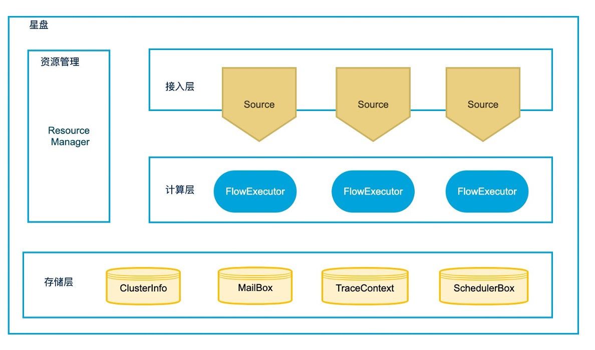

# 目录
+ [项目简介](#项目简介)
+ [核心功能](#核心功能)
+ [快速开始](#快速开始)
+ [系统架构](#系统架构)
+ [业界系统对比](##业界系统对比)
+ [用户文档](#用户文档)
  + [开发指南](##开发指南)
    + [FlowDSL](###FlowDSL)
    + [流程编制](###流程编制)
    + [流程编排](###流程编排)
    + [流程埋点](###流程埋点)
    + [实验分析](###实验分析)
  + [星盘拓展](##星盘拓展)
+ [相关文档](#相关文档)
+ [团队简介](#团队简介)
+ [开源计划](#开源计划)


# 项目简介
随着大数据和人工智能的不断发展，越来越多的业务提出了实时数据挖掘的需求。例如客服投诉处理，交通事件快速发现，舆情监控等。实时数据挖掘的挑战主要表现为以下几个方面：
+ 第一, 数据量大且保存时间不能太长，这通常出于成本或用户隐私的考虑。
+ 第二, 数据处理流程是智能模型+人工或规则，例如客服场景中，会先用NLP模型处理用户投诉内容，初步归因后再分发给相关客服处理。流程很长且有异步交互，难以监控和分析。
+ 第三, 开发复杂的挖掘流程, 需要和很多微服务交互, 如果采用Flink等流式大数据框架, 业务代码和系统代码耦合度高, 开发效率低和维护成本高。 

为解决以上三方面的问题, 我们开发了**星盘(Horoscope)——基于模型编排的实时数据挖掘框架，主要定位是辅助构建云原生场景下的智能信息处理和决策系统**。
目前星盘系统已经在滴滴地图的交通事件快速发现, 交通安全异常事件检测的业务场景中经受了多年的考验。我们现在将星盘内核框架开源，旨在和社区一起共创更好的实时数据挖掘产品。

# 核心功能
+ **交互式的流程编排**
  + 星盘基于BPM模型，设计了一种"代码化的流程图"流程图语言FlowDSL, 
    用于编制和编排微服务调用，人工交互和业务规则。开发者可以通过交互式的控制台，观测实时数据，不断迭代和优化挖掘流程。
+ **按需热埋点**
  + 端到端的算法可以用反向传播-梯度下降来自动优化效果，而由胶水代码串起来的多个算法过程无法进行端到端的优化。
  + 星盘设计了一种按需热埋点的机制，支持跨流程, 分主题和配置化的埋点，解决复杂流程难监控和分析的问题。
+ **流程实验**
  + 支持不同流程调用的A/B实验，同时, 基于FlowDSL可以方便扩展一些高级的实验功能, 例如超参调优实验, 主动学习采样实验。
+ **分布式执行机制**
  + 星盘支持flow的分布式执行，基于Akka实现了高并发和全异步的实时流架构。

# 快速开始
+ [快速搭建服务](./docs/programming-guides/quick-start.md)
+ [股票舆情分析](./docs/examples/demo.md)

# 系统架构


星盘框架是分布式系统，分为三层:
+ 接入层: 系统会接收来自HTTP或消息队列中的数据，按编制和编排的逻辑向微服务分发流量，并产生埋点日志。
+ 计算层: 执行编译后的Flow流程图，支持异步执行，负载均衡和反压。故障恢复时保证at-least-once语义。
+ 存储层: Mailbox用于故障恢复; TraceContext用于保存上下文全局变量, 可实现状态持续监控; SchedulerBox用于延迟调度; ClusterInfo维护分布式节点的信息。具体部署时，存储层依赖Zookeeper和Redis。
+ 资源管理: 分布式系统的节点维护，选主。

# 业界系统对比
开源社区与星盘有相似功能的系统对比如下:
+ [Netflix Conductor](https://github.com/Netflix/conductor): 由Netflix公司开发的面向微服务的流程编制框架, 具备高并发和高可用能力，但不支持流程编排，带状态的计算，流程的描述是JSON，相比BPM，表达能力不够。同时也没有流程可视化，交互式，按需热埋点功能。
+ [Camunda Zeebe](https://github.com/camunda/zeebe): 是由Camunda公司研发，基于云原生的工作流引擎，主要业务是可BPM业务流程编制，具备高并发，高可用能力，支持带状态的计算和流程可视化。但不支持流程编排功能。
+ [AWS Step Functions](https://aws.amazon.com/step-functions): 由AWS开发的适用于分布式应用程序的可视化工作流引擎，不开源，主要做流程编制，编排方面功能不够丰富。

综上所述, 业界主流的分布式流程编制引擎, 并不同时支持流程编排，带状态的计算，按需热埋点和交互式这些功能，星盘正是一个能同时提供这些功能的开源框架。


# 用户文档
## 开发指南
### FlowDSL
星盘设计了一种叫做FlowDSL的配置文件来描述模型(或服务)之间的编制和编排关系。"编制"面向可执行的单个流程，而"编排"则强调多个流程之间的合作。
+ **FlowDSL示例**
    ```
    1  # /demo/stock
    2  
    3  * GetStock
    4  ``` restful
    5  get https://money.finance.sina.com.cn/quotes_service/api/json_v2.php/CN_MarketData.getKLineData?symbol=${stock}&scale=${scale}&ma=no&datalen=${count}
    6  ```
    7  ***
    8    stock_data <- @stock_data
    9    stock_id <- stock_data["stock_id"]
    10   scale <- stock_data["scale"]
    11   count <- stock_data["count"]
    12   stock_result <- GetStock(stock=stock_id, scale=scale, count=count)
    13   <> {
    14     ? got_response = stock_result.length() > 0
    15     => {
    16     }
    17   }
    18  ***
    ```
  该示例片段摘自[股票舆情分析](./docs/examples/demo.md)，完整的Flow代码可参见horoscope-examples/flow。
+ **概念解释**
    + Flow名称: 使用URL表示，鼓励将项目中的Flow组织成层级结构。
    + 模型或服务声明: 3-6行是模型或服务声明，无论模型还是服务调用，都可以视为对数据进行加工组装（Composite）的过程，所以这里将其称为Compositor。声明语法类似markdown的code引用，第一行是名称声明，风格必须是大写驼峰，下面是服务的类型和code。
    + 编制过程描述: 8-17行是编制过程描述，其中8-11行是ETL过程(Assign)，12行是服务调用过程(Composite)，13-17行表示分支。编制过程的每个步骤都需要有一个名称(Symbol)，命名风格采用C/Unix的格式(小写字母+下划线)。

+ **数据结构** 
Flow流转中的数据结构与JSON类似，可以是整数、浮点数、字符串、布尔等基本类型，可以是词典、列表等文档类型，也可以是前述类型的任意组合。关于数据结构的详细文档参见[星盘数据结构](./docs/programming-guides/data-structure.md)。   
Flow的核心逻辑是对来自数据源的数据进行加工处理，处理过程包含外部服务调用(Composite)、简单ETL(Expression)和用户自定义函数(Builtin)三类。
    + 服务调用 / Composite  
    作为流程编排框架，星盘首要的职责就是串联特征服务、模型服务和外部系统。我们将所有的外部调用看成是对数据做加工和组织的过程，所以在星盘中称之为compositor，认为其职责是对数据做composite。  
    星盘默认提供了RestfulCompositor和KafkaProducerCompositor两个工厂类，用户也可以按需自行扩展，具体的扩展方法参见[详细开发文档](./docs/programming-guides/developer-guide.md)。 
    
    + ETL过程/表达式  
    在进行复杂编制时为了串联各种compositor，需要引入大量的ETL逻辑。为了方便支持ETL，星盘在JSONPath基础上扩展了表达式的语法，提供的表达式种类有：  
        + 特殊标识符： 使用"$"和"@"两个特殊标识符，$前缀用来引用用全局变量， @前缀用来引用Flow的入参 
        + 常量：符合JSON语法的数据均可用来当做常量
        + 基本运算：支持+-*/%等五种数值运算，not、and、or等逻辑运算，和字符串拼接等文本运算
    
    + 用户自定义函数 / Builtin  
    当业务逻辑较复杂时，表达式不能满足所有需求时，可以用户编写UDF来实现。星盘的UDF扩展支持Scala或者Python语言。  
    星盘默认提供了数值运算、字符串处理、集合/列表/字典操作等UDF，具体见[星盘默认提供的Builtin](./docs/programming-guides/builtin.md)。  
    如果提供的Builtin不满足需求，也可以自行扩展，具体的扩展方式参见[详细开发文档](./docs/programming-guides/developer-guide.md)。
   
### 流程编制
星盘编制的主要设计思路是"代码化的流程图"。整个编制文件看起来像是程序代码，但仍要当成流程图来理解。整个执行过程从结果倒推，下游节点在需要时触发上游节点执行。  
具体支持的编制语句有Assign、Composite、Branch三大类，下面简要说明，具体参见[详细开发文档](./docs/programming-guides/developer-guide.md)。
+ Assign: 用于保存中间执行结果的节点， 也可以类比一般编程语言的赋值语句
+ Composite: 用于生成服务调用的节点，支持批式调用形式
+ Branch: 条件-分支语句，类似C/Java里的Switch-case语句

### 流程编排
星盘流程编排有Include、Subscribe、Schedule、Callback四种形式。
+ **Include**: 是将其他flow引入到当前flow中，也可以理解为当前flow触发另一个flow的执行，类比一般的函数过程调用。
+ **Subscribe**: 是从一个flow中订阅流量，被订阅的flow不感知被订阅，不支持返回值。
+ **Schedule**: 延时调度其他flow。
+ **Callback**: 指调用外部服务并接收异步反馈的机制。调用外部服务后，等待外部服务的反馈来继续接下来的流程运行，当前flow的上下文会暂时保存在缓存中。

具体使用方式参见[详细开发文档](./docs/programming-guides/developer-guide.md)

### 流程埋点
基于星盘提供的灵活的编排能力，复杂业务流程的串联会变得非常方便。但相对地，跨多业务流程的日志分析就会变得困难。针对这个问题，框架特地设计了主题埋点方案，提供给用户面向业务分析主题、跨异步流程、配置化方式进行埋点的能力。
+ 面向业务主题：每个业务分析需求就是一个埋点主题(topic)，一个埋点topic会生成一份数据，包含分析依赖的所有字段。
+ 跨多流程：框架允许用户直接对多个流程的日志字段进行收集，节省多次离线关联操作。
+ 配置化：用户可以通过配置化方式来指定埋点字段，当前版本仅支持在本地配置，更新配置后需要重启服务。

具体使用方式参见[详细开发文档](./docs/programming-guides/developer-guide.md)

### 实验分析
星盘提供A/B实验功能
+ **A/B实验**
  支持flow级别的A/B实验，系统会自动埋点实验字段，埋点日志可接入Hive或ES等大数据组件。星盘未来会开源简易的控制台，支持生成实验报告。
+ **其他实验探索**
星盘在模型/策略自动优化做了一定探索，例如模型超参数调优实验，主动学习采样实验等，将在以后陆续开源。


## 星盘拓展
星盘框架具有良好的可扩展性, 开发者可以按自己的业务需求扩展, 我们欢迎社区成员一起共建星盘生态。
+ 服务调用拓展/Compositor
+ 复杂逻辑拓展/UDF&BuiltIn
+ 数据源拓展/Source
+ I/O交互拓展/Store
+ 实验拓展/Experiment
+ 控制台拓展(前端)/Api

具体拓展方式参见[星盘拓展文档](./docs/programming-guides/opensource-expand.md)

# 相关文档
+ **开发者手册**
  + [快速搭建服务](./docs/programming-guides/quick-start.md)
  + [股票舆情分析](./docs/examples/demo.md)
  + [FlowDSL详细开发文档](./docs/programming-guides/developer-guide.md)
  + [星盘数据结构](./docs/programming-guides/data-structure.md)
  + [流程编制默认Builtin](./docs/programming-guides/builtin.md)
  + [星盘拓展文档](./docs/programming-guides/opensource-expand.md)

+ **设计文档**
  + [Flow编译执行原理](./docs/detail-design/flow-compiler.md)
  + [Flow运行时原理](./docs/detail-design/flow-runtime.md)

# 团队简介
+ **创始人:** [Flying Weng(温翔)](https://github.com/flyingwen)
+ **团队:** 滴滴地图-交通大数据-挖掘引擎
+ **贡献者:** [Chai Yi](https://github.com/cy736732813), [Cyanny Liang](https://github.com/lgrcyanny), [Frank Liu](https://github.com/Frankliu23), [Zhanghy Zhang](https://github.com/BigBigCatCat), 
  [Mavrick 
  Zhao](https://github.com/MaverickZwt), [Mahuan Ma](https://github.com/jxyzmahuan), [Sheying Wang](https://github.com/tiankonghewo), [Songling Zhang](https://github.com/code-zhangsl), [Pengfei Wang](https://github.com/polarfox17), 
 [Yiran Chen](https://github.com/chenyiran0599), [Amily Zhang](), [Mingyuan Li](https://github.com/MJLee00), [Xinghao Yang](https://github.com/yang620), [Chengyi Hu](https://github.com/xtuhcy)

# 开源发展方向
星盘开源后希望和社区一起共同建设的方向如下：
+ **星盘控制台**：星盘框架提供了流程编排管理的API，我们内部基于这些API研发了路网更新专用的控制台，目前还不能开源，社区用户可以参与构建星盘控制台。
+ **星盘的拓展**：开发者可以贡献通用的UDF，Compositor，也可以拓展Source和Store。
+ **系统优化**：对系统内部执行机制有兴趣的同学，可以一起改善和优化星盘内核和分布式执行机制。
+ **星盘的文档**：改进星盘的开发者手册，设计文档等。

