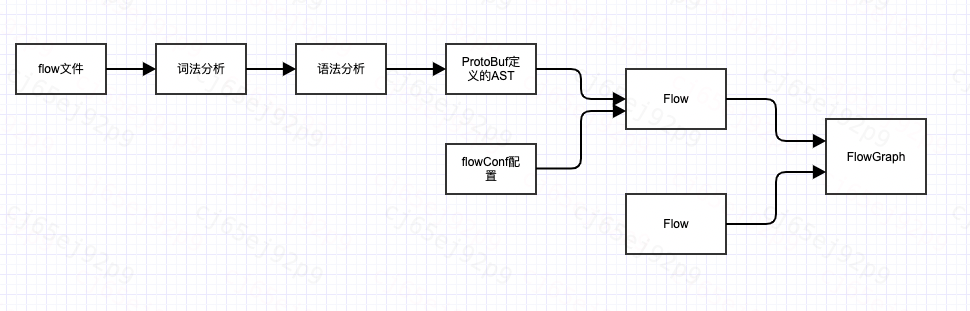

# 星盘编译原理

## 星盘编译整体流程

+ 星盘使用[ANTLR4](https://github.com/antlr/antlr4)将flow文件编译成ProtoBuf中间文件存放在内存中。

+ ProtoBuf表示语法树信息，并进行扩展支持compositor、自定义算子builtin等；根据配置文件flowConf和ProtoBuf生成编排关系flowGraph。
+ flowGraph的顶点是ProtoBuf，边支持include,subscribe,schedule,callback关系，include和schedule为flow语法支持 ,subscribe和callback为配置文件支持。
+ 中间文件Protobuf交给FlowExecutor执行，后续支持分布式FlowExecutor

## 星盘关键定义文件
+ [星盘ANTLR4语法定义](../../horoscope-core/src/main/antlr4/com/didichuxing/horoscope/dsl/Flow.g4)

+ [星盘中间文件ProtoBuf定义](../../horoscope-core/src/main/proto/flow_dsl.proto)

## 案例

+ **股票舆情案例代码**:[stock.flow](../../horoscope-examples/flow/stock.flow)

+ **股票舆情案例代码编译后ProtoBuf中间文件**:[stock.proto](./stock.proto)
