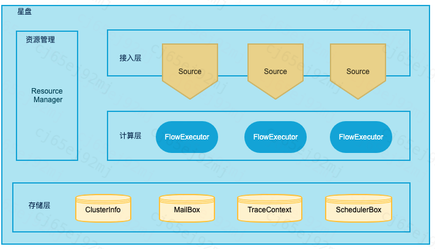
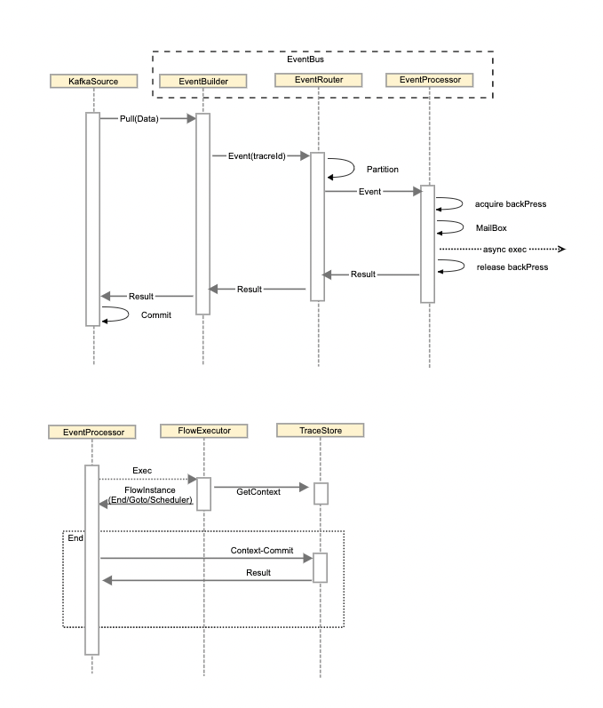

# 1.星盘系统整体架构

## 接入层
+ 负责接收外界事件，可以是kafka、[DDMQ](https://github.com/didi/DDMQ)等异步消息，也可以是http等同步消息
+ 事件源对应一个Source，不同Source之间是隔离的
+ 接入层对消息分区，将不属于自己的消息转发给其他服务器，消息按Source的维度转发
+ 接入层是有状态的，对状态的存取由接入层调用存储层完成

## 计算层
+ 支持分布式和Local执行模式, 每个机器会启动一个FlowExecutor实例
+ 事件在执行时会按trace_id进行一致性hash, 分配到FlowExecutor上执行, 如果遇到延迟调度, 异步callback, trace上下文会缓存在存储层的TraceContext中
+ FlowExecutor基于Akka框架实现, 具备良好的并发执行能力

## 存储层
+ 负责保存星盘系统的所有状态
+ mailBox:事件进入星盘会先放入mailbox, 当执行完成会从mailbox删除, 执行中宕机, 支持重放mailbox, 即支持at-least-once语义, mailbox支持反压
+ traceContext：每个event执行的上下文
+ schedulerBox：延迟触发或持续监控的消息池
+ clusterInfo：机器服务器信息

## 资源管理
+ 负责星盘分布式集群的资源分配，如：集群的选主、扩容、缩容等

# 2.执行流程
以下流程描述一个事件触发FlowExecutor执行的过程:

+ kafkaSource负责消费kafka中数据，并维护kafka位点进行commit
+ EventBuilder负责事件的生成
+ EventRouter负责事件分发
+ EventProcessor负责获取反压并使用actor放入mailbox中
+ 相同traceId必须串行执行
+ 一个trace上，后面的flow能看到前一个flow的修改
+ 使用actor模型，将事件放入mailbox中，后续由Akka异步执行
