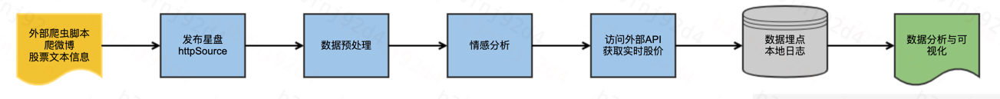
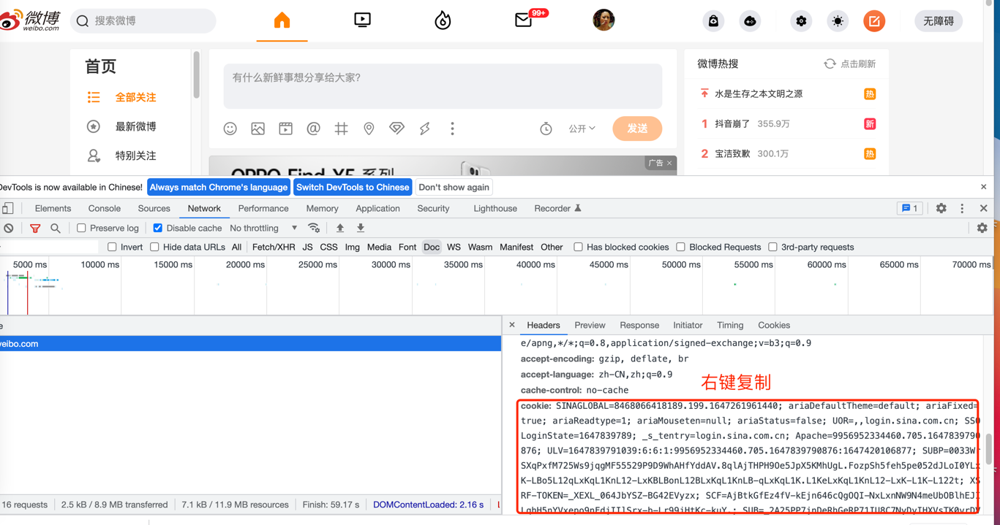
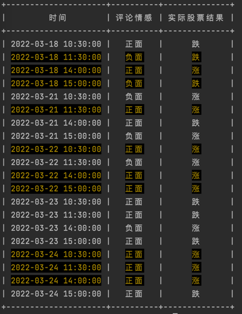
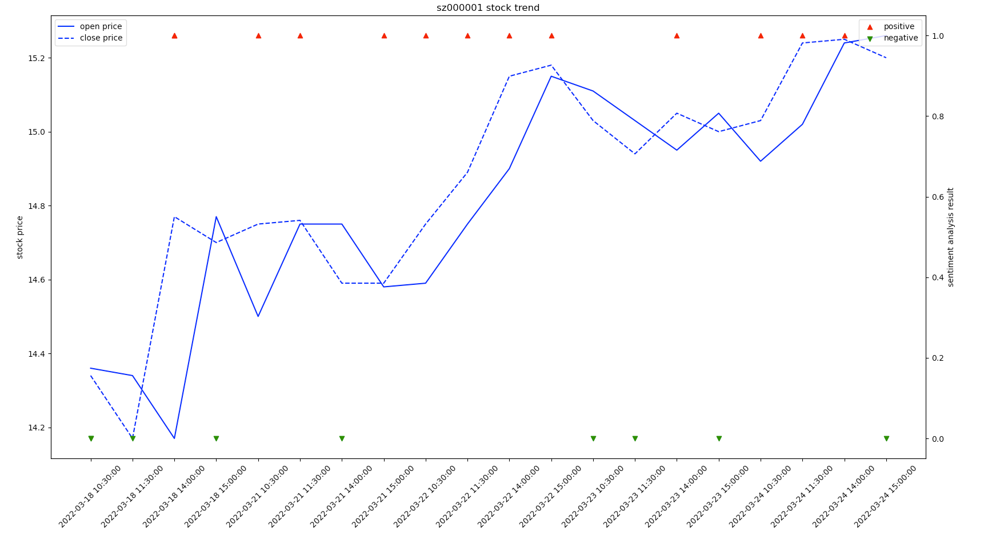

本教程将帮助你快速构建一个星盘样例

## 股票舆情分析系统
本示例从微博抓取股票新闻, 用阿里云情感分析模型判别情绪(正向, 负向), 同时收集实时的股票价格, 用星盘埋点, 收集一段时间的数据, 再用机器学习判断相关性，分析股票价格走向


## 本地环境
+ python 3.6版本以上
+ bs4 4.9.3 (pip install lxml)
+ jdk 1.80

## 1. 星盘服务启动
```shell
cd horoscope-examples/dist
./bin/service.sh start
```

## 2. 微博登陆cookie获取
使用自己账号登陆微博，从chrome浏览器中获取登陆cookie，替换$cookie变量，如下所示

## 3. 阿里云密钥获取
使用自己账号登陆阿里云官网，
进入https://help.aliyun.com/document_detail/176652.html?spm=a2c6h.12873639.0.0.462d5100ydNMDM
页面申请开通nlp自然语言通用服务，点击个人账号进入https://ram.console.aliyun.com/manage/ak?spm=a2c8b.12215442.top-nav.dak.18fb336a6gZbWK
AccessKey管理页面,点击创建AccessKey
获取AccessKey ID 和 AccessKey Secret 替换$key和$secret变量

## 4. 样例服务启动
使用上述变量cookie、key、secret执行如下脚本
```shell
cd horoscope-examples/dist
chmod -R 777 ./demo/demo.sh
./demo/demo.sh start $cookie $key $secret
```
## 5. 分析结果
进入/dist/demo文件夹执行drawing.ipynb文件查看情感分析和股票结果

## 结果展示
根据用户评论进行情感分析可以得出如下结论：
我们统计了2022-3-18 10：30 到 2022-3-24 14：00的20条股票数据，
同时分析此阶段微博用户对平安银行的评论，可以看出高亮部分为预测成功的结果



绘制股票趋势图如下, 红色三角代表评论分析为正的结果，绿色三角代表评论分析为负的结果
虚线为股票闭盘，实线为股票开盘
