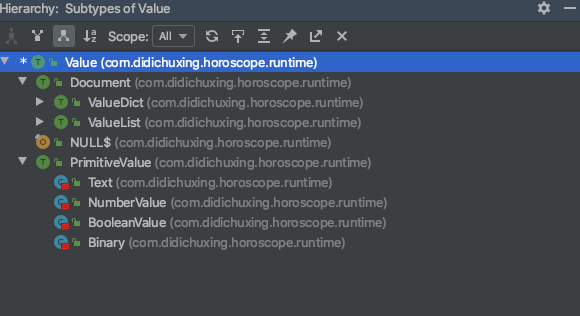

# 星盘数据结构   
星盘中会将流转过程中的数据结构统一表示成Value类。   

  
上图是Value类的体系结构，主要有以下扩展类型：
+ Text: 文本类型
+ NumberValue: 数值类型
+ BooleanValue: 布尔类型
+ Binary: 二进制类型  
+ Document: 文档类型，包括列表([]）和字典({})两种类型
    + 其中列表([])是indices为自然数的Value集合，字典({})是indices为字符串的Value集合。列表的index是从0开始递增的连续自然数列，词典的index星盘不会默认为字典序，而是倾向于保持原始数据的序列化顺序，访问不存在的index会报错。  
    + 另外，和外部系统交互时，我们会把Json和ProtocolBuffer等格式转化为Value对象统一处理。当然，Value也能转化为JSON和PB等格式，同时我们也定义了内部二进制序列化格式以提升效率。
        ```
        message FlowValue {
            message List {
                repeated FlowValue child = 1;
            }
         
            message Dict {
                map<string, FlowValue> child = 1;
            }
         
            oneof value {
                bytes binary = 1;
                double fractional = 2;
                int64 integral = 3;
                string text = 4;
                bool boolean = 5;
                List list = 6;
                Dict dict = 7;
            }
        }
        ```